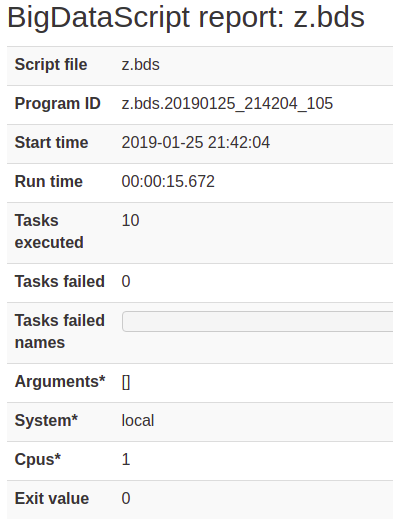
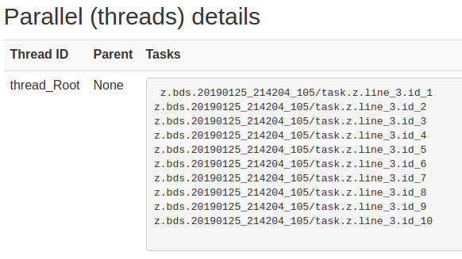

# Logging 
Logging is mundane and boring, but many times necessary. Not many people enjoy adding hundreds of line of code just to perform logging. That's why `bds` can log everything for you.

Both `sys` and `task` commands create a shell file, execute it and save STDOUT and STDERR to files.
This gives you an automatic log of everything that was executed, as well as the details of the outputs and exit status from each execution.

For example, let's create a simple program and run it
```
task echo Hello
```

When `bds` executed a `task` statement, it produces the following files (for each task statement):

1. `taskId.sh`: A shell file with the commands to execute (e.g. `z.bds.20140328_224825_685/sys.line_4.id_1.sh`). This shell file is executed when the task runs.
1. `taskId.stdout`: Redirected `stdout` when executing the script file
1. `taskId.stderr`: Redirected `stderr` when executing the script file
1. `taskId.exitCode`: Exit code from the script

**Note:** By default all these files are deleted, unless you use the `-log` command line option when invoking `bds`

Now let's run this script, we use `-log` command line option to make the output verbose:
```
$ bds -log z.bds
Hello
```
This run will create a directory (format: `programName.YYYYMMDD_hhmmss.PID`) containing all the files mentioned:
```
$ ls z.bds.20190125_210218_852
task.z.line_1.id_1.exitCode       # Exit code
task.z.line_1.id_1.sh             # Shell script from task
task.z.line_1.id_1.stderr         # STDOUT from running shell script
task.z.line_1.id_1.stdout         # STDERR from running shell script
```

# Shell file
In the previous example the shell script would look like this:
```
$ cat task.z.line_1.id_1.sh
#!/bin/bash -eu
set -o pipefail

cd '/home/pcingola'

# SYS command. line 1
echo Hello
# Checksum: eda733b2
```

By default `bds` executes all tasks as `/bin/bash -eu; set -o pipefail`.
This means that any error in the execution (including undefined shell variables) will make the shell script fail, thus the task will also fail.
The type of shell and parameters used can be changed using the `taskShell` parameter from `bds` config file (`$HOME/.bds/bds.config`).

**WARNING:** Since `bds` creates a shell file and then executes it, in some systems this might lead to a `text file busy` error. Particularly this might happens if the file systems is slow (e.g. too much I/O load on some systems).
If this happens, you can tune the `waitTextFileBusy` parameter in `bds` config file (`$HOME/.bds/bds.config`).

###STDOUT / STDERR
As we mentioned in the previous section, all tasks save `STDOUT` and `STDERR` to files, in the previous example the `STDOUT` file looks like this:
```
$ cat task.z.line_1.id_1.stdout
Hello
```
and the STDERR file is empty

### Exit code
`bds` saves the exit code of each task in `taskId.exitCode` file.
In the previous example, which executed succesfully, the exit file is:
```
# Note that the '$' prompt is right after the '0' exit code (no newline)
$ cat task.z.line_1.id_1.exitCode
0$
```

# `sys` commands
As opposed to `task` commands, a `sys` does not execute a shell script, but executes the commands as inline.
For instance the next program:
```
sys echo hi
```
Will actually create a process `/bin/bash -eu -o pipefail -c "echo hi"`

Nevertheless `bds` will still create a shell file for each `sys` command for tracebility and logging pourposes.
This is also quite usefull for debugging.
If you execute the previous program using '-log' command line opton you get:
```
$ bds -log z.bds
00:00:00.491	Executing command. Arguments: [/bin/bash, -euo, pipefail, -c, echo hi]
hi
```
And also the shell file is created:
```
$ ls z.bds.20190125_212208_750/
sys.z.line_1.id_1.sh
```

The shell file looks like this:
```
# Execution shell: /bin/bash -euo pipefail -c

echo hi
```

### Disappearing tasks
Sometimes tasks just disappear from clusters.
This is far more common than most people think, particularly if there is some issues with the cluster (nodes malfuntioning, nodes being purged, cluster management software issues, etc.)

Sometimes clusters fail in ways that the cluster management system is unable to detect, let alone report the error.
It can happen that tasks disappear without any trace from the cluster (this is not as rare as you may think, particularly when executing thousands of tasks per pipeline).
For this reason, `bds` performs active monitoring, to ensure that tasks are still alive.
If any task "mysteriously disappears", `bds` reports the problem and considers the task as failed.

`bds` will monitor the cluster's queue every one minute to check if all the tasks that were submitted to the cluster are still in the queue.
If a task is not found in the clueter's queue for 3 times in a row, it will be marked as 'dissapeared' (i.e. failed).

`bds` logs information about any dissapearing tasks.

### Postmortem information
When a task fails in a cluster, `bds` will collect post mortem information.
This is detailed information about the task that failed.
This information is usually necesary to debug cluster issues and clusters administrators often require it when solving problems.
Many cluster systems only allow for collecting this information only after some period of time after the task dies, that's why `bds` collects this data and saves it immediately after the task fails.


### Html report
`bds`, when run using the `-log` command line option, produces an HTML report every one minute (if there are tasks executing) or at the end of the script (if any task was executed).
The report is roughly divided in these sections: Program, Timeline, Parallel, Tasks

####Html report: Program 
Program name, command line arguments, system type, execution start time and elapsed time, etc.



####Html report: Timeline
Shows the timeline for all tasks (keep in mind that the colors have no meaning).


####Html report: Tasks
Several details about each executed task: 

- First column: task number (sequential), task name, task ID, PID, etc.
- Second column: exit code, task state, state of dependencies, number of retries, required CPUs and memory.
- Third column: Start / end time, elapsed time and timouts.
- Fourth column: Dependencies input files, output files and task IDs of dependecies.
- Fifth column: Program shell file, STDOUT (tail 10 lines), STDERR (tail 10 lines), output file checking, post-mortem information.


*Note:* The second column is colored in red when the task had execution 'ERROR' state.

####Html report: Parallel
Detail about execution threads. Only usefull if your program has `par` statements, in this example there are no `par` statements, so the section only contains one item (main thread) whihc executed all the tasks.



