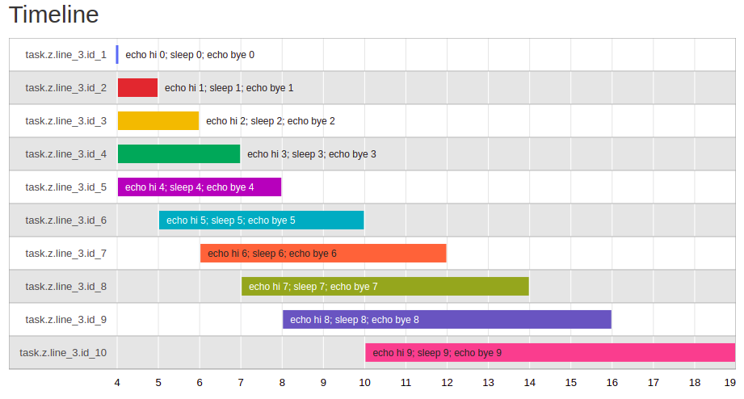
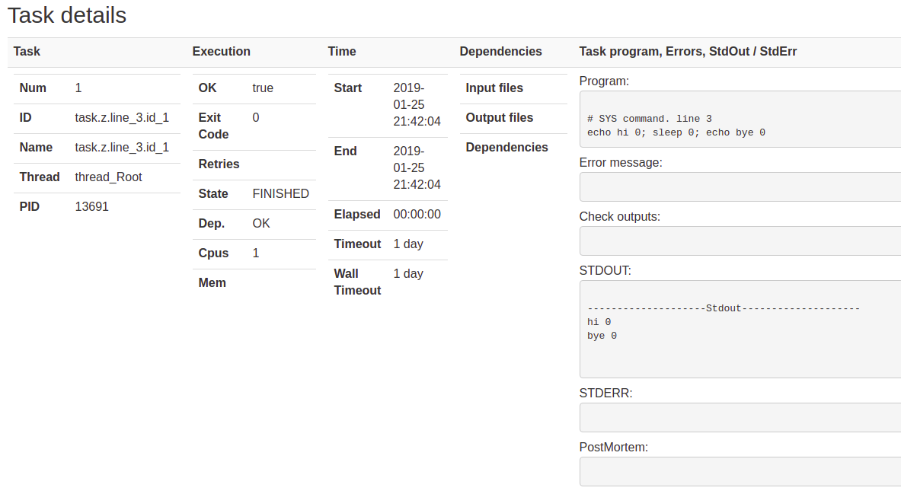

# Reports

`bds` will create HTML and/or YAML reports with summary information and some details for each task executed.
These reports can be very useful for debugging bds programs implementing complex pipelines.

## Html report
`bds`, when run using the `-log` command line option, produces an HTML report every one minute (if there are tasks executing) or at the end of the script (if any task was executed).
The report is roughly divided in these sections: Program, Timeline, Parallel, Tasks

The report file name is
```
program_file.bds.YYYYMMDD_hhmmss_ms.report.html
```
where:

- `program_file.bds` is the program file name
- `YYYYMMDD` is the year, month and day when the program was executed
- `hhmmss_ms` is hour, minute, seconds and milliseconds when the program was executed

### Html report: Program 
Program name, command line arguments, system type, execution start time and elapsed time, etc.


### Html report: Timeline
Shows the timeline for all tasks (keep in mind that the colors have no meaning).



### Html report: Tasks
Several details about each executed task: 

- First column: task number (sequential), task name, task ID, PID, etc.
- Second column: exit code, task state, state of dependencies, number of retries, required CPUs and memory.
- Third column: Start / end time, elapsed time and timouts.
- Fourth column: Dependencies input files, output files and task IDs of dependecies.
- Fifth column: Program shell file, STDOUT (tail 10 lines), STDERR (tail 10 lines), output file checking, post-mortem information.



*Note:* The second column is colored in red when the task had execution 'ERROR' state.

### Html report: Parallel
Detail about execution threads. Only usefull if your program has `par` statements, in this example there are no `par` statements, so the section only contains one item (main thread) whihc executed all the tasks.


## YAML report

The YAML reports contains the same information than the HTML report, but in YAML format so it can be easily injested by analysis programs.

The report file name is
```
program_file.bds.YYYYMMDD_hhmmss_ms.report.yaml
```
where:

- `program_file.bds` is the program file name
- `YYYYMMDD` is the year, month and day when the program was executed
- `hhmmss_ms` is hour, minute, seconds and milliseconds when the program was executed

## CSV Report: Task time vs Input / Output file sizes

This report shows task details as well as input / output file sizes.
This report is useful to analyze execution times and find task execution anomalies.

This is a CSV formatted file, so you can load it and analyze it in Excel or Python.

The report file name is
```
program_file.bds.YYYYMMDD_hhmmss_ms.time_size.csv
```
where:

- `program_file.bds` is the program file name
- `YYYYMMDD` is the year, month and day when the program was executed
- `hhmmss_ms` is hour, minute, seconds and milliseconds when the program was executed

The columns in this report are:

- `task_done_ok`: This boolean field indicates if the task finished successfully, and without any errors 
- `task_state`: Task state
- `task_exit_value`: Exit code from task's shell script
- `task_name`: Task name (i.e. `taskName` variable defined in the task)
- `task_id`: Task ID (created internally by `bds`)
- `cpus`: Number of CPUs requested for this task
- `mem`: Amount of memory (in bytes) requested for this task (-1 means "unlimited")
- `custom_resources`: List of custom resources and values (e.g. `gpus=4`). If there is more than one custom resource, the list is separated by semicolons
- `time_in_seconds`: Task's execution time in seconds.
- `total_input_file_size`: Sum of all the task's input file sizes
- `total_output_file_size`: Sum of all the task's output file sizes
- `input_file_size_details`: List of all the task's input files and their sizes (i.e. `filename=size`). If there is more than one input file, the list is separated by semicolons
- `output_file_size_details`: List of all the task's output files and their sizes (i.e. `filename=size`). If there is more than one output file, the list is separated by semicolons
